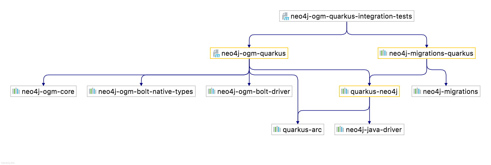

= Neo4j-OGM Quarkus Extension
Michael Simons <michael.simons@neo4j.com>
:doctype: article
:lang: en
:listing-caption: Listing
:source-highlighter: coderay
:icons: font
:latest_version: 1.5.0
:groupId: org.neo4j
:artifactId: neo4j-ogm-quarkus
:branch: main

[abstract]
--
This is an extension for https://quarkus.io[Quarkus.io], depending on the official https://github.com/quarkiverse/quarkus-neo4j[Quarkus Neo4j Extension].
Neo4j-OGM Quarkus configures https://github.com/neo4j/neo4j-ogm[Neo4j-OGM] to use
the low-level connectivity provided by the Quarkus Neo4j extension.
--

image:https://github.com/michael-simons/neo4j-ogm-quarkus/workflows/build/badge.svg[link=https://github.com/michael-simons/neo4j-ogm-quarkus/actions]
image:https://maven-badges.herokuapp.com/maven-central/org.neo4j/neo4j-ogm-quarkus/badge.svg[link=https://maven-badges.herokuapp.com/maven-central/org.neo4j/neo4j-ogm-quarkus]

== Introduction

This extension is meant to be used on top of https://github.com/quarkiverse/quarkus-neo4j[Quarkus Neo4j Extension].
It uses the driver provided with the latter to configure Neo4j-OGMs `SessionFactory`, so that you can get an instance in
beans like this:

[source,java]
----
import java.util.Collection;

import javax.enterprise.context.ApplicationScoped;

import org.neo4j.ogm.session.SessionFactory;

@ApplicationScoped
public class MovieRepository {

	private final SessionFactory sessionFactory;

	MovieRepository(SessionFactory sessionFactory) {
		this.sessionFactory = sessionFactory;
	}

	public Collection<Movie> findAll() {
		return sessionFactory.openSession().loadAll(Movie.class);
	}
}
----

In addition, it will take care that all classes annotated with `@NodeEntity` and `@RelationshipEntity` are discovered by
Quarkus in both JVM and native mode.

NOTE: Please note that this extension only supports connections via the Bolt-protocol.

== Downloads

Maven artifacts are available on https://search.maven.org/artifact/org.neo4j/neo4j-ogm-quarkus[central] under
the following coordinates: `{groupId}:{artifactId}:{latest_version}`.

NOTE: There is no need to declare any other dependency (for Neo4j-OGM or Quarkus-Neo4j, this extension here brings both of them).

=== Include in a Maven build

[source,xml,subs="verbatim,attributes"]
----
<dependency>
    <groupId>{groupId}</groupId>
    <artifactId>{artifactId}</artifactId>
    <version>{latest_version}</version>
</dependency>
----

=== Include in a Gradle build

[source,groovy,subs="verbatim,attributes"]
----
dependencies {
    implementation '{groupId}:{artifactId}:{latest_version}'
}
----

== Manual

The underlying Neo4j-Driver extension is documented in the Quarkiverse: https://quarkiverse.github.io/quarkiverse-docs/quarkus-neo4j/dev/index.html[Quarkus Neo4j].
The Neo4j-OGM manual is https://neo4j.com/docs/ogm-manual/current/[here].

There is little to be configured in this extension itself apart from a few properties:

[.configuration-reference, cols="80,.^10,.^10"]
|===

h|Configuration property

h|Type
h|Default

a|🔒 `org.neo4j.ogm.base-packages`

[.description]
--
An optional list of packages to scan. If empty, all classes annotated with `org.neo4j.ogm.annotation.NodeEntity @NodeEntity` or `org.neo4j.ogm.annotation.RelationshipEntity @RelationshipEntity` will be added to the index.
--|list of string
|

a| `org.neo4j.ogm.use-native-types`

[.description]
--
Should Neo4j native types be used for dates, times and similar?
--|boolean
|`false`

a| `org.neo4j.ogm.use-strict-querying`

[.description]
--
This flag instructs OGM to use all static labels when querying domain objects.
--|boolean
|`false`

a| `org.neo4j.ogm.database`

[.description]
--
The database that should be used (Neo4j EE 4.0{plus} only). Leave empty for using the default database.
--|string
|

|===

[.configuration-legend]
🔒 Configuration property fixed at build time - All other configuration properties are overridable at runtime

== Dependencies

The `integration-tests` module is a good candidate for showing how the dependencies flow in the Neo4j-Quarkus ecosystem:

`quarkus-neo4j` - the official Quarkiverse extension - sits in the middle. It provides the `neo4j-java-driver`, the essential connectivity.
Depending on it are `neo4j-ogm-quarkus` (this project) and inside the integration tests, `neo4j-migration-quarkus` which runs the Cypher-scripts
with our test data for us.
`neo4j-ogm-quarkus` brings the necessary dependencies for Neo4j-OGM itself, and of course, contains all the Quarkus "magic" to make things work
nicely together.
